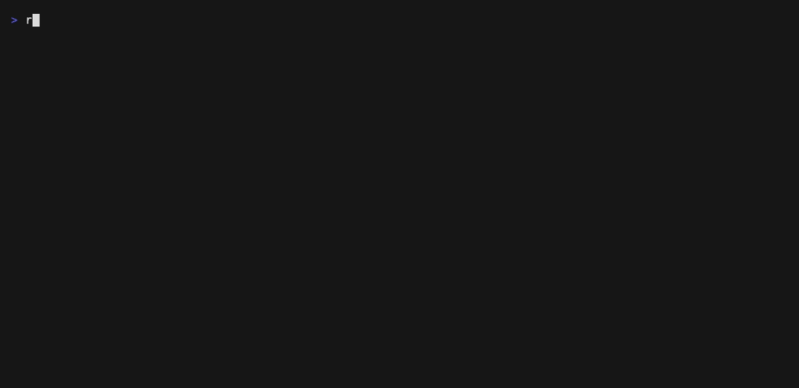
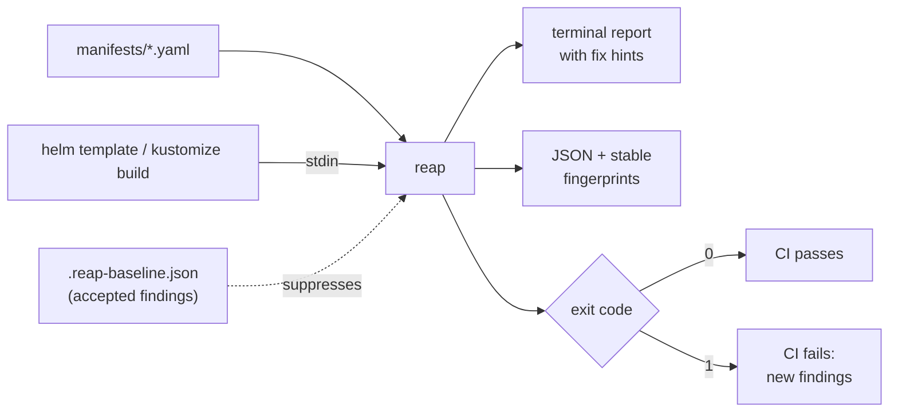

# reap

[](https://github.com/emphity1/reap/actions/workflows/ci.yml)
[](https://github.com/emphity1/reap/releases/latest)
[](LICENSE)

Find and cut wasted GPU spend in Kubernetes. Static checks for ML/GPU workloads, from your CI to your cluster.

`reap` scans Kubernetes manifests for GPU waste and ML workload
misconfigurations — idle GPUs, bad scheduling, missing production-readiness —
and reports them in your terminal and in CI, before they cost you money.
Think "kube-linter, specialized for GPU and ML workloads."

It reads local files only: no network, no credentials, no cluster access,
no telemetry.



## Who is it for

- **ML engineers** writing a PyTorchJob or a vLLM deployment, who want to know
  *before* deploying what will be rejected, deadlock, or crash with cryptic
  shared-memory errors.
- **DevOps / platform engineers** who want a CI guardrail so GPU manifests
  that waste money or break production never merge.
- **Anyone paying the GPU bill** who wants "job hung since Thursday" and
  "notebook idle all weekend" caught by a linter, not by the invoice.

Where it fits:



## Install

Prebuilt binaries for Linux, macOS, and Windows (amd64/arm64) are on the
[Releases](https://github.com/emphity1/reap/releases/latest) page. Or:

```sh
# with Go installed
go install github.com/emphity1/reap/cmd/reap@latest

# from source
git clone https://github.com/emphity1/reap.git && cd reap && make build

# as a Docker image (distroless, ~5 MB, amd64/arm64)
docker run --rm -v "$PWD:/work:ro" ghcr.io/emphity1/reap:v0.2.1 /work
helm template . | docker run --rm -i ghcr.io/emphity1/reap:v0.2.1 -
```

Images are published to [GHCR](https://github.com/emphity1/reap/pkgs/container/reap)
on every release (`:vX.Y.Z` and `:latest`); `make docker` still builds a
local `reap:dev` from source.

## Usage

```sh
# lint a file or a directory (scanned recursively for *.yaml / *.yml)
reap ./manifests/

# lint rendered charts / overlays via stdin
helm template . | reap -
kustomize build . | reap -
```

Example output (severity-colored on a terminal; `-color auto|always|never`,
`NO_COLOR` respected):

```
manifests/app.yaml
  Deployment/ml/llm-inference
    [error] no-gpu-limit
        container "server" requests nvidia.com/gpu: 1 but sets no limit; Kubernetes rejects GPU
        requests without an equal limit, so this manifest will not deploy
        fix: set resources.limits["nvidia.com/gpu"] equal to the request

reap: 2 objects checked, 1 finding (1 error, 0 warning, 0 info)
```

Findings are grouped by file and object, ordered by severity (errors
first), and every finding carries a concrete fix.

### Exit codes

| Code | Meaning                                          |
|------|--------------------------------------------------|
| 0    | no findings at/above the threshold               |
| 1    | findings at/above the threshold (CI should fail) |
| 2    | usage or input error                             |

The threshold is set with `-fail-on` (`info`, `warning`, `error`, or `none`
to always exit 0); the default is `warning`.

### JSON output

`-format json` emits a machine-readable report (schema version `1`):

```json
{
  "version": "1",
  "summary": {
    "objectsChecked": 2,
    "findings": 1,
    "bySeverity": {"error": 1, "warning": 0, "info": 0},
    "suppressed": 0,
    "staleBaselineEntries": 0
  },
  "findings": [
    {
      "ruleId": "no-gpu-limit",
      "severity": "error",
      "message": "container \"server\" requests nvidia.com/gpu: 1 but sets no limit; ...",
      "object": "Deployment/ml/llm-inference",
      "detail": "server/nvidia.com/gpu",
      "source": "manifests/app.yaml",
      "fix": "set resources.limits[\"nvidia.com/gpu\"] equal to the request",
      "fingerprint": "c3c88f7fa45669b8"
    }
  ]
}
```

`fingerprint` is the finding's **stable identity**: a hash of the rule ID, the
object reference (`Kind/Namespace/Name`), and a semantic detail key (container
and resource names — never positional indices). Message wording, severity,
suggested fix, and **file path are metadata and never enter the hash**, so the
same chart produces the same fingerprint whether linted from a file or piped
through stdin, and fingerprints survive copy edits and file moves. Identical
logical findings from different files (e.g. two overlays defining the same
object with the same violation) deliberately share one fingerprint. The
baseline mechanism is a set of these fingerprints.

### Adopting reap on an existing repo (baseline)

Existing repos have existing findings. Accept them once, then gate CI only on
*new* problems:

```sh
reap -write-baseline .reap-baseline.json ./manifests/   # day one: accept the past
reap -baseline .reap-baseline.json ./manifests/         # from then on: only new findings fail
```

The baseline file is JSON — fingerprints plus human-readable context and an
optional `reason` field per entry; commit it to the repo. Suppressed findings
are hidden from the output and the exit-code gate, and the summary reports
both how many were suppressed and how many baseline entries went **stale**
(matched nothing — fixed for real, so prune them). `-baseline` and
`-write-baseline` are mutually exclusive; to refresh a baseline, run
`-write-baseline` again.

## CI

GitHub Actions — this repo doubles as an action:

```yaml
- uses: emphity1/reap@v0.2.1
  with:
    path: ./manifests/
    fail-on: warning
    # baseline: .reap-baseline.json
```

GitLab CI — copy the job from
[`docs/ci/gitlab-ci.yml`](docs/ci/gitlab-ci.yml).

Releases are built by GoReleaser on version tags (`v*`): prebuilt binaries
for Linux, macOS, and Windows (amd64/arm64) appear on the
[Releases](https://github.com/emphity1/reap/releases) page.

## Rules

Rules see pod templates wherever manifests put them: the core workload
kinds (Pod, Deployment, StatefulSet, DaemonSet, Job, CronJob, ...) plus
CRDs that embed templates in nested maps **or arrays** — Kubeflow's
PyTorchJob/TFJob/MPIJob, RayCluster and RayJob worker groups, Volcano Job
tasks. The rule set is dogfooded against real vendor charts (KubeRay,
NVIDIA GPU Operator, JupyterHub, vLLM production-stack, KServe, Triton,
Kueue, Volcano, ...) and upstream tutorial manifests; the reproducible
harness and its findings live in [`hack/dogfood/`](hack/dogfood/).

| ID                | Severity | Checks                                                                 |
|-------------------|----------|------------------------------------------------------------------------|
| `no-gpu-limit`    | error    | a container requests a GPU without an equal limit (rejected by the API server; the request/limit pair must be equal for extended resources) |
| `job-no-deadline` | warning  | a GPU `batch/v1` Job or CronJob sets no `activeDeadlineSeconds`, so a hung run holds its GPUs indefinitely (same-named CRD kinds, like Volcano's Job, are recognized and skipped — their schema differs) |
| `model-server-no-probes` | warning | a known inference server (vLLM, Triton, TGI, TorchServe, SGLang, Ollama, the KServe serving runtimes, NIM, LMDeploy) has no `readinessProbe`, so traffic arrives minutes before the model finishes loading |
| `distributed-training-no-gang-scheduling` | warning | a multi-replica GPU training job (PyTorchJob, TFJob, MPIJob, XGBoostJob, PaddleJob) has no visible gang-scheduling config (`runPolicy.schedulingPolicy`, Kueue/KAI/YuniKorn queue labels, Volcano/coscheduling scheduler or annotations) — replicas can deadlock holding GPUs |
| `shm-too-small` | warning | a GPU container has no memory-backed `/dev/shm` (`emptyDir` with `medium: Memory`); the 64 MB default makes shared-memory users — PyTorch DataLoader workers, NCCL, Triton's Python backend — crash or stall with cryptic errors. Deliberately broad: the fix is cheap and harmless; runtimes that never touch shared memory should baseline it |
| `gpu-no-node-targeting` | info | a GPU workload sets no `nodeSelector`, node affinity, or tolerations; on clusters with tainted GPU nodes it sits `Pending` and the autoscaler won't scale the GPU pool for it |
| `multinode-no-topology-affinity` | info | a multi-replica GPU training job expresses no placement intent (affinity, `topologySpreadConstraints`, `nodeSelector`, or topology-aware scheduler hints) — NCCL collectives fall back to the slow network path |
| `notebook-no-idle-culling` | info | a GPU notebook (Jupyter image or Kubeflow `Notebook`) has no visible idle-culling configuration — a forgotten notebook holds its GPU all weekend |
| `inference-no-hpa` | info | a model-server `Deployment`/`StatefulSet` has no HPA targeting it in the linted input — fixed replicas idle GPUs off-peak or throttle at peak |
| `no-pdb` | info | a model server has no PodDisruptionBudget selecting its pods in the linted input (`matchLabels` matching; `matchExpressions` PDBs are assumed to match) |

Every rule ships with passing and failing fixtures in `testdata/`. Severity
is a discipline: `error` means the manifest is broken, `warning` means money
or uptime is at risk, `info` marks heuristics and cross-object checks whose
evidence may legitimately live outside the linted files — those explain
themselves and lean on the baseline.

Deliberately **not** checked, because a manifest cannot answer it: actual GPU
utilization (a runtime measurement — needs DCGM/metrics, a later phase) and
node-pool scale-to-zero (lives in Terraform or autoscaler CRDs, not in
workload manifests). A linter that guesses burns trust; these return only
when they can be answered honestly.

The same honesty applies to **operator-managed serving and training CRDs**
(KServe `InferenceService`, Kubeflow Trainer v2 `TrainJob`): their pod
construction belongs to the operator or a referenced runtime, not to the
manifest. KServe injects probes and autoscales on its own, and a `TrainJob`
carries no pod template at all — so pod-level findings there would be
unfixable or plain wrong. reap lints what *you* control; workloads those
operators generate are linted where they are defined (e.g. a
`ClusterTrainingRuntime` rendered to YAML pipes into `reap -` like anything
else).

## Development

```sh
make build   # build bin/reap
make test    # go test ./...
make lint    # gofmt + go vet
```

See [CONTRIBUTING.md](CONTRIBUTING.md). Licensed under [Apache 2.0](LICENSE).
